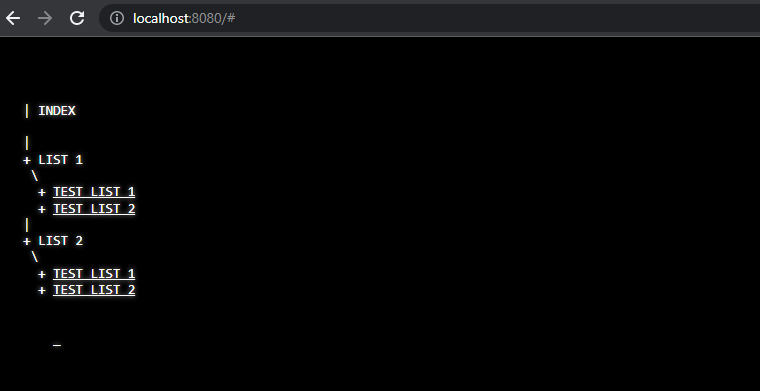
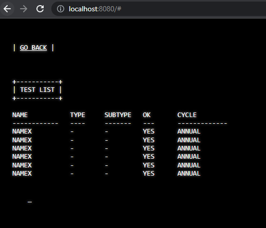

# html-docs-console
 Console like formatted documents in html. 
 
 ## Quickstart
 - Just add files to `contents` folder and edit `index.html`
 - Edit `app.js` variables to your liking
 - Start a local http server
 
 ## Features:
 - Dynamically load pages using XMLHttpRequest
 - Typewriter effect with blinking cursor
 - Links are automatically added
 - Custom 404 page
 - Custom global header and footer
 
## Screenshots
### Index page

 
 
 
### Content page
 

## License
Distributed under MIT License. See`license.md`for more information.